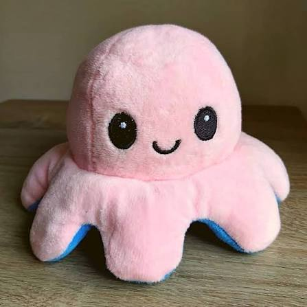

# supreme-octo-happiness

  

[Baseline](./baseline.py) -Baseline model without any optimization. It is a simple model that can be used as a starting point for further development.

[Fused QKV](./fused_qkv.py) - QKV matrices are fused into a single matrix to reduce memory access and improve performance. Attention across all heads is computed all at once in a single matrix multiplication, which can lead to significant speedups.

[RoPE](./rope.py) - RoPE has been implemented. 

[Model](./model.py) - It has all the ideas mentioned above.